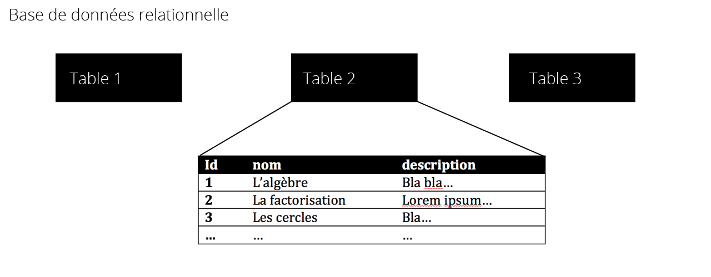
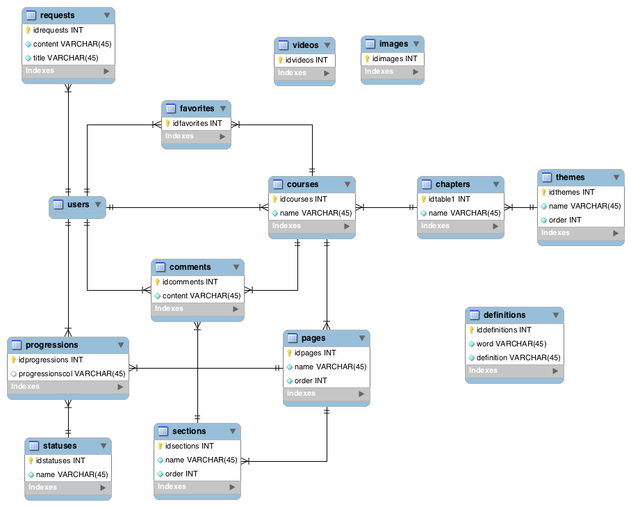
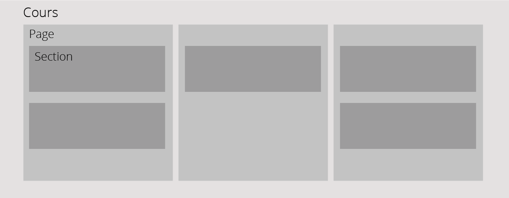

==================
Modèle relationnel
==================

############
Introduction
############

Une base de données est un outil permettant, comme son nom l'indique, de stocker des données persistantes pour ensuite les réutiliser ou les conserver. Dans le domaine du web, on utilise des base de données relationnelles. Traditionnelement elle se découpe en plusieurs tableaux, ou plutôt tables dans le jargon, contenant des colonnes et des lignes. On crée des tables pour représenter des objets, des cours par exemple, qui ont des attributs représentés par des colonnes et chaque ligne est un enregistrement, c'est-à-dire une entité, un objet, 1 cours dans notre exemple. Une table a pratiquement toujours une colonne ID qui est un nombre, un identifiant unique qui permet de trouver un enregistrement parmi les autres de la table. On l'appelle *clé primaire*. Ils servent aussi à créer des relations entre les tables, un lier un enregistrement à un autre, d'une table différente ou non, comme nous le verrons ensuite dans la construction du module de cours. Pour communiquer avec la base de données relationnelles, notamment chercher tous les enregistrements d'une table ou seulement 1, créer ou mettre à jour un enregistrement, etc, on utilse le language SQL, Structured Query Language.

    Schéma résumant une base de données relationnelle

Le modèle relationnel est une modélisation de la base de données du site. Attardons-nous donc sur le modèle qui se cache derrière les fonctionnalités évoquées précédemment. Nous commencerons par le point centrale de la base données: les tables et relations qui concernent les cours et qui forment la majeur partie du modèle et ensuite nous verrons les tables additionelles qui complètent le modèle relationnel et ajoutent les fonctionnalités auxiliaires.

Il est important de savoir que Django fourni en tant que framework plusieurs outils facilitant le travail avec une base de données. Chaque table de notre BD est représenté par ce qu'on appelle un modèle, c'est un simple fichier Python qui contient les informations de notre table. Ces fichiers permettent ensuite à Django de générer lui-même les tables et ensuite de fournir une série de méthodes qui permettent de communiquer avec la BD sans utiliser directement SQL qui est le seul language que comprend la BD. Django nous évite donc d'apprendre un nouveau language. Nous verrons ces méthodes plus tard dans les exemples d'utilisation.

##########
Les cours
##########

************
La structure
************

    Le schema de toutes les tables du modèle relationnel

Le fait que la structure des tables relationnelles reflètent la structure que perçoit le rédacteur facilitent grandement la compréhension. Nous avons vu qu'un cours de compose de plusieurs pages, qui elles-mêmes contiennent plusieurs sections avec un titre et un contenu et que l'auteur pouvait ajouter ou retirer des éléments à sa guise. C'est exactement la même chose dans le modèle. Tout d'abord on trouve une tables ``courses`` qui contient les informations de base qu'entre le professeur au début du processus et qui sont les colonnes suivantes: ``name``, ``description``, ``difficulty``, il reste le champs ``chaptitre`` que nous verrons plus tard. Ensuite il y a la table ``pages`` avec les colonnes ``name`` qui est le titre de la page et ``course_id`` qui signale la relation avec le cours. En effet chaque page appartient à un cours et vice-versa un cours possède donc plusieurs page, grâce à la clé étrangère - champs qui contient l'ID, l'identifiant d'un enregistrement d'une autre table - ``course_id`` qui relie les deux tables. L'utilisation plus précise de la relation est expliqué dans la partie suivante. Finalement pour terminer l'ensemble il reste la table ``sections`` qui a les colonnes ``name``, ``content`` et ``page_id``, un titre, un contenu et à l'instar des pages une clé étrangère qui la relie à une page. Donc une section appartient à une page et une page a plusieurs sections. Pour résumé les relations, un cours a plusieurs pages et chacune de ses pages a plusieurs sections. Comme dit précédement on comprend facilement les relations en observant comment les tables sont implémentés dans l'interface de rédaction d'un cours.

    Schema qui résume les relations des tables courses, pages et sections

***********
Utilisation
***********

Tous les examples d'opérations sur la base de données sont d'abord écrit avec les méthodes de Django puis en SQL pur. Une des particularités de Django quant il s'agit de sauvegarder des objets dans la base de données est qu'il fait appelle à des formulaires, écrit dans le code sous forme de ....Form, comme CourseForm par exemple. On utilise ces mêmes formulaires dans les vues pour générer les formulaires que complètent les utilisateurs, comme pour s'inscrire sur le site. Ils permettent en fait simplement de relier les données soumises par les utilisateurs à nos modèles Django (je rappelle que les modèles sont dans Django la représentation de nos tables de la BD) et par conséquent de créer ou mettre à jour des enregistrements.

Chercher tous les cours afin de créer une liste de liens pour pouvoir les consulter

.. code-block:: python

    Course.objects.all()

.. code-block:: sql

    SELECT * FROM courses

Créer un nouveau cours. On crée d'abord le cours, puis une page associée contenant une section.

.. code-block:: python
    
    # on utilise un formulaire
    # request.data est un dictionnaire contenant les données soumise par un utilisateur
    course_form = CourseForm(request.data)
    if course_form.is_valid():
        # on crée le cours
        course = course_form.save()
        # on crée la page associée
        page = Page(name="Première page", order=1, course_id=course.id)
        page.save()
        # on crée une section associée à la page
        page.sections.create(name="Première section", order=1)

.. code-block:: sql

    SELECT * FROM courses
